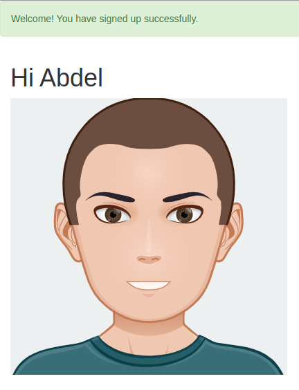

# Customize Devise authentication with Active Storage

> This repo is to have the source code of my [tutorial]() about how to customize the Devise Gem authentication using Active Storage

## Built With

- Ruby >= 2.6.5
- Rails >= 6.0.3
- Javascript
- HTML5
- CSS3

## Live Demo

[Live Demo Link](https://whispering-retreat-92662.herokuapp.com)

## Prerequisites

- [PostreSQL](https://www.postgresql.org/download/)

### Setup

Clone or download the repo:

```
$ git clone https://github.com/abdelp/custom-authentication-with-devise.git
```

### Install

```
$ cd custom-authentication-with-devise
$ bundle
$ rails db:create
$ rails db:migrate
```

### Usage

Inside the root folder run:

```
rails s
```

#### Register


To register a new user you:

1. Can optionally select an image as an avatar of the user.
2. Need to input the full name of your user.
3. Need to select a username, the username cannot be already taken by another user.
4. Need to indicate your email.
5. A password of at least 6 characters.

#### Login


To login, it is only required to specify the username.

#### Profile



### Deployment

To deploy on Heroku:

1. You need to register an account on [Heroku](https://www.heroku.com)

2. After that, inside the root folder, you need to create and migrate the project:

```
$ heroku create
$ git push heroku master
$ heroku run rails db:migrate
```

## Authors

👤 **Abdel Perez**

- Github: [@abdelp](https://github.com/abdelp)
- Twitter: [@AbdelPerez11](https://twitter.com/AbdelPerez11)
- Linkedin: [abdel-perez](https://www.linkedin.com/in/abdel-perez)

## 🤝 Contributing

Contributions, issues and feature requests are welcome!

Feel free to check the [issues page](issues/).

## Show your support

Give a ⭐️ if you like this project!

## 📝 License

This project is [MIT](lic.url) licensed.
